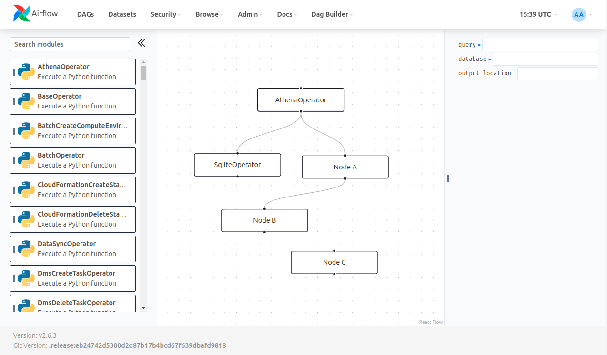

# Airflow Dag Builder

Airflow plugin to allow low/no-code users to create/edit Dags via drag-and-drop on a convenient UI.  
**Currently in development - Not ready for production use.**

## Roadmap
- [ ] First working version
- [ ] Code cleanup + performance improvements

## Developer docs

Ensure you have the following requirements installed:
- `NodeJS 20+` with `npm`
- `Python 3.9+` with `poetry`
- `Docker` with `docker-compose`

### Frontend development
- Go to the `frontend` directory
- Run `npm install` to install the required dependencies
- Run `npm run start` to start the app
You can now modify the frontend/UI files located in the `src/flow-builder` directory.

Once done, run `make dag-builder` in the root folder, to compile React files and copy them automatically to the airflow `plugins` folder.

### Backend/plugin development
- Run `poetry install`
- Go to the `airflow` directory
- Run `docker-compose up -d` to start the Airflow instance
You can now modify the plugin's files located in the `plugins` directory.
